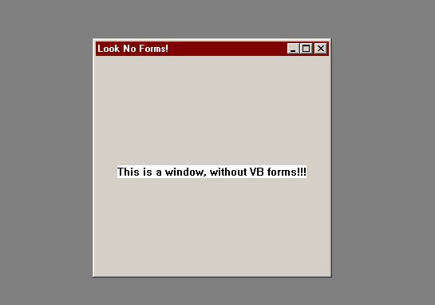



## Make an application entirly from APIs \!\!\!\!

### Description

This is a realy cool piece of code to create an apllication window using the API. Demonstrates creating classes, using call back and windows messeging.
 
### More Info
 

             |
---                |---
**Submitted On**   |2002-05-15 17:14:54
**By**             |[Richard Croxford](https://github.com/Planet-Source-Code/PSCIndex/blob/master/ByAuthor/richard-croxford.md)
**Level**          |Advanced
**User Rating**    |4.4 (22 globes from 5 users)
**Compatibility**  |VB 5\.0, VB 6\.0
**Category**       |[Windows API Call/ Explanation](https://github.com/Planet-Source-Code/PSCIndex/blob/master/ByCategory/windows-api-call-explanation__1-39.md)
**World**          |[Visual Basic](https://github.com/Planet-Source-Code/PSCIndex/blob/master/ByWorld/visual-basic.md)
**Archive File**   |[Make\_an\_ap834645152002\.zip](https://github.com/Planet-Source-Code/richard-croxford-make-an-application-entirly-from-apis__1-34814/archive/master.zip)

### API Declarations

LOTS AND LOTS!

